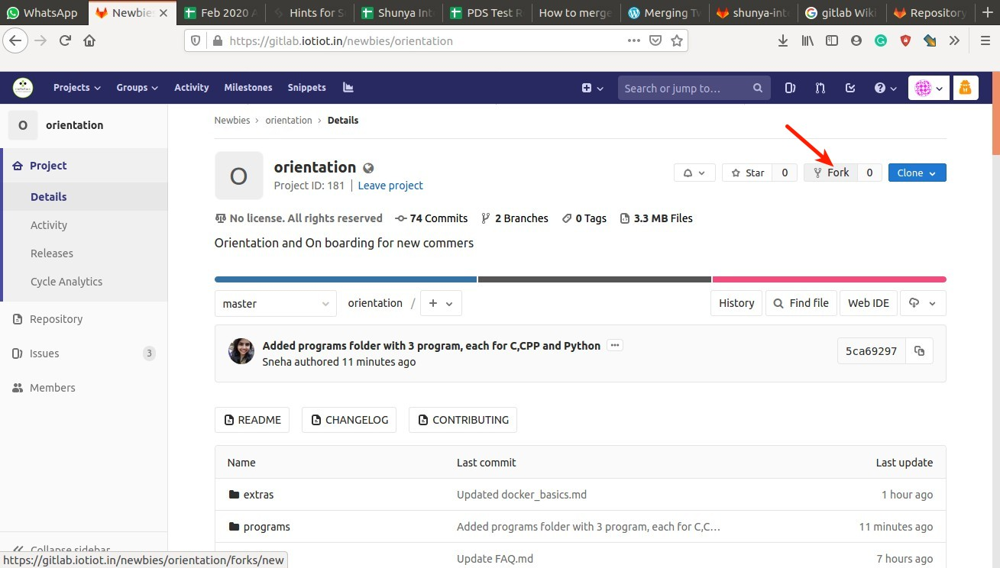
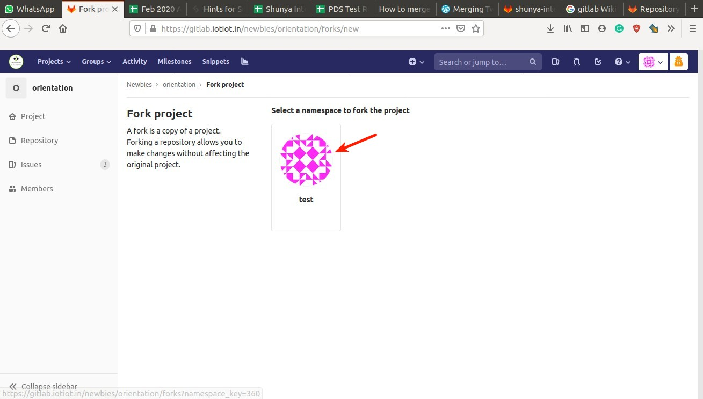
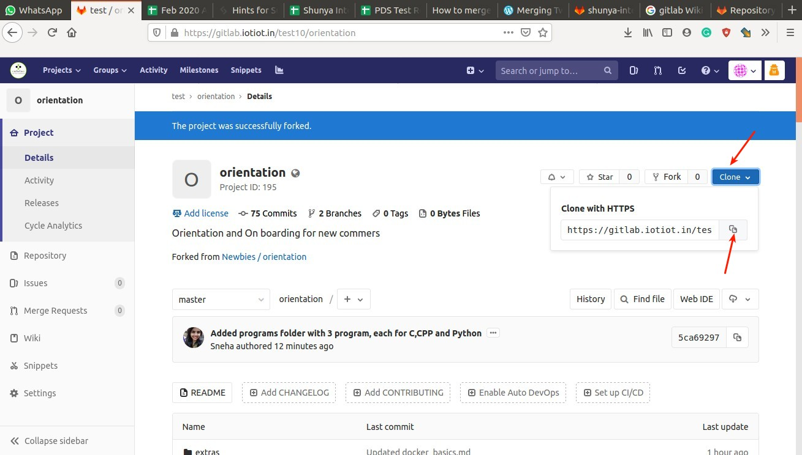

# Orientation/On Boarding

#### What do you need? 
You must have at-least 4-5 hours of free time, stable Internet, to complete all steps given here.
You will have to read carefully, understand and do things.

## How to read the document
- Scan through the document once and understand all the steps.
- Then start to complete the steps.

#### Index of what you will you learn?
1. Culture and the Mission of IoTIoT.in and Shunya OS
1. Faster approach towards learning - 20hrs learning method 
1. Basic Git Work-flow
1. Project management - GitLab Interface
1. Document like a professional coder
1. Docker Basics
1. Coding Style

> **Innovation is seeing what everybody has seen and thinking what nobody has thought**.  
Famous quote by Dr. Albert Szent-Györgyi, discovered Vitamin C.

Our Key **Innovations** are our **Processes** .We have arranged common course material in a structured way learnt by training over 300 students and optimized to anchor core concepts and master the subject by doing  practical assignments.

## Step 1 : Learn About the culture of our company

****Know our mission :**** [IoTIoT.in Vision & Mission](http://bit.ly/iotiotvision)

1. We have a very flat culture. No hierarchy, if you are part of any team, 
you must be told the goal you are working towards, your task cannot be a just a 
task you are asked to complete.
2. You take ownership for your task/issue.
3. You should be empathetic in your documentation (make it super easy for 
others to understand with diagrams flow charts and minimal bookish language)
4. Be **open minded** to learn new ways and **persistent** to complete things you take up .

## Step 2: Faster approach towards learning - 20hrs learning method 
We are a startup and we have an innovative approach to Learning.  
Watch the video on [20 hr Learning](https://www.youtube.com/watch?v=5MgBikgcWnY).  
We follow this approach throughout our learning process.  

## Step 3 : Using Same OS to avoid OS issues
We use Ubuntu 16.04 as our default OS. Please install it on to your system, so
that you can work with us.  

Learn how to install Ubuntu 16.04 in this [guide](install_ubuntu.md) 

## Step 4 (a) : Learn how to use git 
Git is the way we manage code and there is no software development without git.  
Please follow this [guide](git_basics.md)

## Step 4 (b) : Learn how to use GitLab

We do all our work inside GitLab. And knowing the interface will help you get around.  

* Learn about [Issues](https://docs.gitlab.com/ee/user/project/issues/) here.
* Learn about [Repository](https://docs.gitlab.com/ee/user/project/repository/) here

## Step 4 (c) : Learn how to document like experienced developers
Experienced developers write documentation in Markdown.  

Learn Markdown by following this interactive [Tutorial](https://www.markdowntutorial.com/lesson/1/)

## Step 4 (d) : Learn Docker basics
Now you might be thinking :thinking: about why we need to learn docker. The reason is it becomes hard to manage dependencies as we build large projects and if we want to deploy them in various environments. So we will be using docker to deploy our product. For this you don't need to master docker but need to have basic skills. Learn [Docker Basics here](docker_basics.md).

## Step 4 (e) : Coding Style
Coding style is how your code looks, plain and simple. And by “your,” I actually mean you, the person who is reading this. Working in the professional environment, it should become a practice to follow certain style in coding and be consistent with it, which helps us to enhance the readability of the code and hence with less bugs. We will be following these(mentioned in above link) standards from now. Read [Coding Style document](coding_style.md) to get to know the style.

## Step 5 : Practical - Your real test here
1. Go to this project : https://gitlab.iotiot.in/newbies/orientation

2. Click on fork button which is at top right of the page, next to clone button, your this step will add orientation repository under your user-name.

3. Clone this repository : `https://gitlab.iotiot.in/<your_user_name>/orientation`

4. Add the Summaries on the topics
    1. Gitlab Interface (Name your summary as : gitlab-interface.md)
    1. Git Basics (Name your summary as : git-basics.md)
    1. 20 hr Learning Video (Name your summary as : 20-hr-learning.md)
    1. Docker Basics (Name your summary as : docker-basics-summary.md)

#### Note:
   * Summaries should be written in `Markdown`.
   * Summaries should be with `more images` and `less text`.
   * Summaries should be in `sections` (not big paragraphs).
   * Summaries should be `concise`, the lesser the better but `must cover all key points`.

5. Coding style Practical: Choose one from C or CPP or Python programs given in 
programs directory. Choose programs on criteria given below.
   1. IoT-C (Product Innovator/Premium Job Seeker) : Choose C Program
   1. IoT-CPP (Camera) and AI-CPP : Choose CPP Program
   1. AI-Python : Choose Python Program

Format chosen program in respective coding styles. See an example of the
formatted C code [here](programs/example_code.c).

6. Commit all your changes (include all files in your directory)
7. Push the changes to the remote repository

------------------------------------------------

# Have Questions about the Process ?
* Checkout our [FAQ section](FAQ.md)
